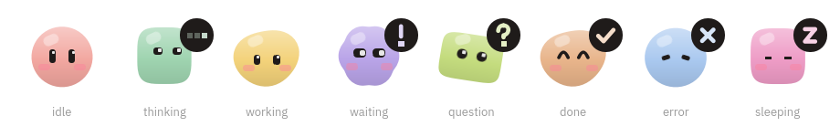

<p align="center"></p>

# Blinky

A small character for every Claude Code and Codex session on your Linux desktop. It sits in the corner of the
terminal its agent runs in, acts out what the agent is doing, and tells you when the agent is done or needs you:
at the PC with a speech bubble and a chime, away from the desk with a push on your phone.

<picture>
  <source media="(prefers-color-scheme: dark)" srcset="assets/preview-dark.svg">
  
</picture>



> [!NOTE]
> Blinky was built for **ghostly-qshell**, my own [Quickshell](https://quickshell.org) setup on Hyprland, which
> is not public. I published Blinky anyway so others can use it or take ideas from it. The QML parts were only
> tested inside that shell and assume Hyprland, so expect rough edges and bugs on other setups. Issues are welcome.

- One blinky per agent, placed by you: drag one from the board onto a terminal and it sits in the window's
  bottom-right corner. Only terminals with a blinky are watched.
- Ten looks by default (colour, body shape, eyes, cheeks), all editable.
- Moods follow the agent: thinking, searching, working, waiting for your OK, asking a question, done, error, and
  asleep after ten idle minutes. Idle blinkies watch your cursor. Poke one; poke it three times fast and it gets
  dizzy.
- When an agent is done, waits or asks, a speech bubble with a short chime opens next to its blinky and stays
  until you have looked at that terminal. Click the bubble to jump there.
- Optional phone pushes through [ntfy](https://ntfy.sh), off by default, with a loudness per kind.
- Agents are named after their project: the repository name from the git `origin`, else the folder.
- A blinky remembers its project: start the agent again in a new terminal and the same blinky sits down on it.
- Scripted runs (`claude -p`, `codex exec`) are ignored; only sessions a person drives count.

Status: works on Arch Linux with Hyprland, Quickshell, Claude Code 2.1 and Codex CLI 0.154. Python 3.11+
standard library only, no dependencies. The board's texts are German, everything else is English.

Contents: [Runs locally](#runs-locally) · [How it works](#how-it-works) · [Setup](#setup) ·
[Phone pushes](#phone-pushes) · [Quickshell](#quickshell) · [Your own looks](#your-own-looks) ·
[Commands](#commands)

## Runs locally

Everything runs on your machine: no server of its own, no account, no telemetry. Session state lives in
`$XDG_RUNTIME_DIR/blinky` and is gone after a reboot; the agent's last answer that the bubble shows never leaves
that folder.

The only thing that can leave the machine is the phone push, and only once you switch it on. It goes to ntfy.sh or
your own ntfy server and carries the blinky's name, the project name, which agent it is, and the tool waiting for
approval or the kind of error. Never agent output, prompts or commands, because anyone who knows an ntfy topic can
read it.

## How it works

```text
Claude Code / Codex ──hook event (JSON on stdin)──> blinky hook <agent>
                                                      ├─ session file in $XDG_RUNTIME_DIR/blinky/sessions
                                                      └─ ntfy push, if its terminal has an awake blinky
                                                         and pushes are on
Quickshell ──runs── blinky watch ──one JSON line per change──> BlinkySessions.qml ──> BlinkyFace.qml
```

1. `blinky setup` adds a hook for every agent event (session start and end, prompt, tool use, permission request,
   notification, stop) to `~/.claude/settings.json` and `~/.codex/hooks.json`.
2. Each event runs `blinky hook claude|codex`. It finds the agent's process, maps the event to a mood (a `Read` or
   `rg` is searching, an edit is working, a permission prompt is waiting, `Stop` is done) and writes the session
   file. Hooks finish within their timeout and never block the agent.
3. Placing a blinky on a terminal stores that terminal's process and Hyprland window address. A session is watched
   when the terminal is one of its parent processes.
4. When a watched session newly waits, asks, finishes or fails, the hook sends a push. "Done" pushes wait up to
   45 seconds, so several finished agents arrive as one.
5. `blinky watch` prints the whole picture as one JSON line whenever something changes. The QML module draws the
   blinkies from it; any other bar can read the same lines.

## Setup

You need Linux, Python 3.11 or newer and Claude Code or Codex. For the characters on screen also Hyprland and
Quickshell; for the chimes `pw-play`, `paplay` or `aplay`.

```sh
git clone https://github.com/mikaeww/blinky.git
cd blinky
bin/blinky setup
```

`setup` writes `~/.config/blinky/config.toml` with a random ntfy topic, merges the hooks into the agent configs
(after a timestamped backup; your other hooks stay), and links `~/.local/bin/blinky`. Running it again is safe.

1. Codex runs new hooks only after you trust them: start `codex` and open `/hooks` once.
2. Put the QML module on Quickshell's import path and add it to your shell, see [Quickshell](#quickshell).
3. Optional: set up phone pushes, see below.

To remove it: `blinky uninstall` takes the hooks out again; then delete `~/.local/bin/blinky`, the clone and
`~/.config/blinky`.

## Phone pushes

1. Install the ntfy app ([iOS](https://apps.apple.com/app/ntfy/id1625396347),
   [Android](https://play.google.com/store/apps/details?id=io.heckel.ntfy)) and subscribe to the topic `setup`
   printed (`blinky status` shows the config path).
2. `blinky test` sends a test push, even while pushes are off.
3. Switch pushes on when you leave the desk and off when you are back:

```sh
blinky phone on
blinky phone off
blinky phone toggle
```

Or use the switch on the board. How loud each kind is (off, quiet, normal, loud) is set on the board or with
`blinky loudness waiting loud`. A self-hosted server: `bin/blinky setup --server https://ntfy.example.com`.

## Quickshell

The module lives in `quickshell/Blinky`:

```sh
mkdir -p ~/.local/lib/qt6/qml
ln -s "$PWD/quickshell/Blinky" ~/.local/lib/qt6/qml/Blinky
# start Quickshell with QML_IMPORT_PATH=$HOME/.local/lib/qt6/qml
```

The full experience on Hyprland, in your `shell.qml`:

```qml
import Quickshell
import Blinky

BlinkySessions { id: blinkies }
HyprlandWindows { id: desk; trackCursor: true; trackWindows: blinkies.placements.length > 0 || board.open }
Variants {
    model: Quickshell.screens
    TerminalBlinkies { required property var modelData; screen: modelData; sessions: blinkies; windows: desk }
}
BlinkyBoard { id: board; sessions: blinkies; windows: desk; onCloseRequested: open = false }
```

Open the board with `board.open = true`, for example from a bar button or an IPC handler. Drag a blinky onto a
terminal, onto an unwatched agent's row, or back onto the card. `TerminalBlinkies` draws the placed blinkies in
their terminals' corners, click-through and hidden while another window covers the corner. The board's `theme`
takes `{fg, muted, base, raised, hover, accent, accentText, font, mono, radius}`.

Just the faces, for a bar:

```qml
Row {
    spacing: 4
    BlinkySessions { id: agents }
    Repeater {
        model: agents.sessions
        BlinkyFace {
            required property var modelData
            width: 24; height: 24
            color: modelData.color; shape: modelData.shape; eyes: modelData.eyes
            blush: modelData.blush; mood: modelData.state; name: modelData.name
        }
    }
}
```

`BlinkySessions` runs `blinky watch` and exposes `looks`, `placements`, `sessions`, `phone`, `error` and the
actions `setPhone`, `place`, `unplace`, `wake`. `BlinkyFace` takes `lookAt` plus `watching: true` to follow the
cursor, `hovered`, `reducedMotion` and `poke()`.

## Your own looks

`blinky skins` prints the current looks. Edits go to `~/.config/blinky/skins.json`, a list of
`{"name", "color": "#rrggbb", "shape", "eyes", "blush"}` with shapes `circle squircle pebble cloud capsule` and
eyes `tall round wide`. Running blinkies change within a second. A broken file is reported and the defaults are
used meanwhile. `blinky skins reset` moves your file to a dated backup.

## Commands

| Command | What it does |
| --- | --- |
| `blinky setup` | config, hooks, link (safe to run again) |
| `blinky status` | current sessions, switches, file paths |
| `blinky phone [on\|off\|toggle]` | show or flip phone pushes |
| `blinky test` | send a test push |
| `blinky loudness [KIND LEVEL]` | push loudness per kind: done/waiting/question/error, off/quiet/normal/loud |
| `blinky sound [on\|off\|toggle]` | show or flip the chimes at the PC |
| `blinky chime done\|attention\|error` | play a chime (synthesised, no sound files) |
| `blinky skins [reset]` | print the looks as JSON, or restore the defaults |
| `blinky place on N --pid P --address A` | put blinky N on a window (the board does this) |
| `blinky place off\|wake\|sleep N` | take blinky N off, wake it, let it sleep |
| `blinky watch` | one JSON line per change, for status bars |
| `blinky uninstall` | remove the hooks |
| `blinky hook claude\|codex` | called by the agents, reads the event on stdin |

| File | Holds |
| --- | --- |
| `~/.config/blinky/config.toml` | ntfy server and topic (only readable by you) |
| `~/.config/blinky/skins.json`, `loudness.json` | your looks and push loudness |
| `~/.local/state/blinky/` | phone switch, remembered projects, `errors.log` |
| `$XDG_RUNTIME_DIR/blinky/` | live sessions and placements |
| `~/.cache/blinky/` | the synthesised chimes |

Hook errors land in `~/.local/state/blinky/errors.log` and in the agent's hook output.

## Check

```sh
python3 tools/check.py
```

Structure limits, compile, 32 tests, `qmllint`. Conventions, decisions and verification plans are in
[docs/](docs/README.md).

## License

MIT, see [LICENSE](LICENSE).
